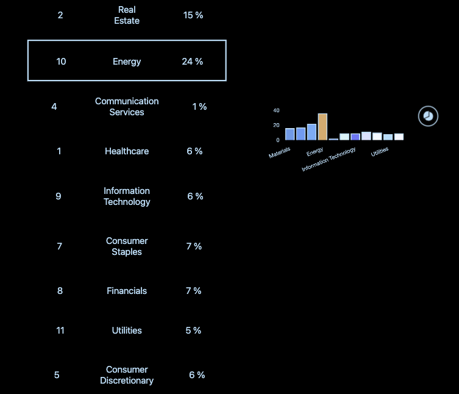

React app about interacting with graphics and interact with them.

This app is fetching data from a API, reduce it to interactions per sector and showing the percentage of those. It is possible to sort (including reverse) and when a sector get highlighted, that sector is also highlighted on the charts (available doughnut and bar chart).

This app is 100% responsive and 100% accessible and works in dark mode.

  
  
  

### To run this app:
1. Clone the repository and open it in your preferred source code editor.
2. Open your terminal and navigate to the project folder: cd substantive-research/my-app
3. Install the necessary dependencies: npm install
4. Run the application: npm start